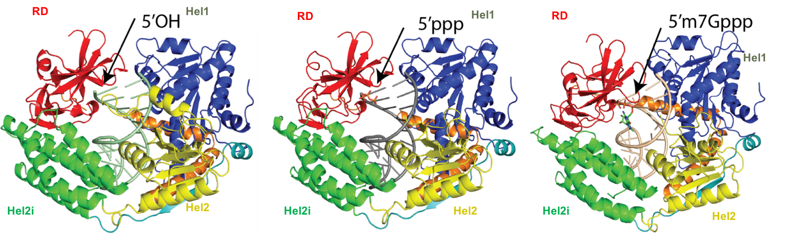
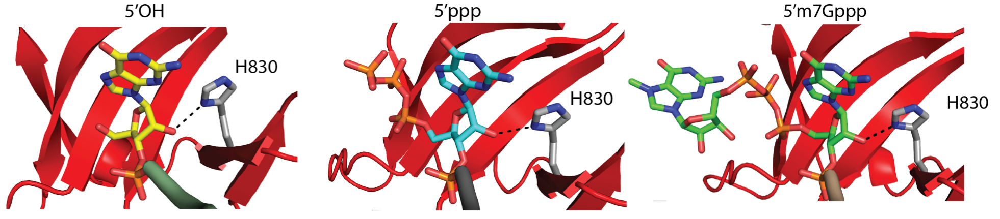

Ligand Preferences of Innate Immune Receptor RIG-I

Chen Wang

Rutgers, The State University of New Jersey

National Institute of Allergy and Infectious Diseases/National Institutes of Health

Biochemical Studies of RIG-I in the Presence of 5’OH, 5’ppp, Cap-0 24mer Hairpin (HP) RNAs

<table>
<tr>
    <th>    </th>
    <th>WT RIG-I      </th>
    </tr>
    <tr>
        <td>RNA ligand</td>
        <td>$K_{d,app}(nM)$</td>
        <td>$k_{atpase}$ ($s^{-1}$)</td>
    </tr>
    <tr>
        <td>5'OH HP RNA</td>
        <td>38.5 $\pm$ 4</td>
        <td>49 $\pm$ 1</td>
    </tr>
    <tr>
        <td>5'ppp HP RNA</td>
        <td>1.8 $\pm$ 0.9</td>
        <td>33 $\pm$ 0.9</td>
    </tr>
    <tr>
        <td>Cap-0 HP RNA</td>
        <td>1.7 $\pm$ 0.5</td>
        <td>25 $\pm$ 0.4</td>

Crystal Structures of RIG-I Helicase-RD with 5’OH, 5’ppp, Cap-0 24mer HP RNAs

Interaction of 2’-OH on First Nucleotide with Histidine 830 (H830)

<table>
<tr>
    <th>    </th>
    <th>WT</th>
    <th>RIG-I</th>
    <th>H830A</th>
    <th>RIG-I</th>
    </tr>
    <tr>
        <td>RNA ligand</td>
        <td>$K_{d,app}(nM)$</td>
        <td>$k_{atpase}$ ($s^{-1}$)</td>
        <td>$K_{d,app}(nM)$</td>
        <td>$k_{atpase}$ ($s^{-1}$)</td>
    </tr>
    <tr>
        <td>5'ppp HP RNA</td>
        <td>1.8 $\pm$ 0.9</td>
        <td>33 $\pm$ 0.9</td>
        <td>1.6 $\pm$ 1.9</td>
        <td>34 $\pm$ 1</td>
    </tr>
    <tr>
        <td>5'ppp 2'-OMe HP RNA</td>
        <td>40 $\pm$ 5</td>
        <td>12 $\pm$ 0.4</td>
        <td>2.3 $\pm$ 0.7</td>
        <td>32 $\pm$ 0.5</td>
    </tr>
    <tr>
        <td>Cap-0 HP RNA</td>
        <td>1.7 $\pm$ 0.5</td>
        <td>25 $\pm$ 0.4</td>
        <td>1.9 $\pm$ 0.5</td>
        <td>22 $\pm$ 0.4</td>
    </tr>
    <tr>
        <td>Cap-1 HP RNA</td>
        <td>425 $\pm$ 50</td>
        <td>15 $\pm$ 0.7</td>
        <td>9.5 $\pm$ 2</td>
        <td>24 $\pm$ 0.3</td>

Summary 

                                                                             

RIG-I recognizes Cap-0 dsRNAs as efficiently as 5′ppp dsRNAs.  
RIG-I accommodates the m7G cap without perturbation of the ppp moiety interactions.  
2’-O-methylation on the first nucleotide of RNA 5’ end is critical for RIG-I discrimination.   
H830 residue is the primary sensor of 2′-O-methylation in Cap-1 dsRNA. 
